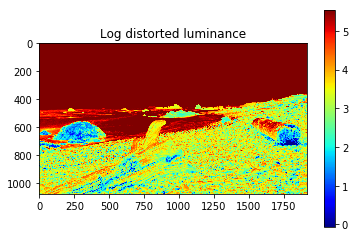
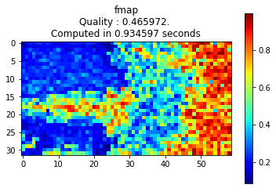
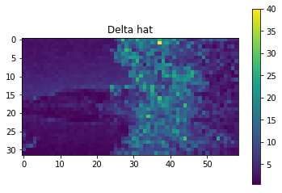
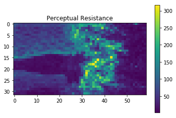
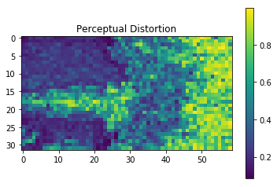

# Blind Quality Estimation by Disentangling Perceptual and Noisy Features in High Dynamic Range Images
Code for implemntation of the proposed perceptual CNN. If you use this software package in your research, we kindly ask you to reference the associated paper.

* Cite: Navaneeth Kamballur Kottayil, Giuseppe Valenzise, Frederic Dufaux and Irene Cheng, "Blind Quality Estimation by Disentangling
Perceptual and Noisy Features in High Dynamic Range Images", *IEEE Transactions on Image Processing*, 2017
* Paper: [IEEE link](http://ieeexplore.ieee.org/document/8123879/), DOI: 10.1109/TIP.2017.2778570.
* Pre-print: [arXiv link](http://arxiv.org/abs/1712.07269)
* A simplified explanation of the proposed method is provided [here](/docs/HDR-PCNN.pdf). 


## Main Contents
* test.py : Usage example for evaluation of the quality of any provided HDR image.
* main.py : Example code to reproduce results in paper. Refer to read me in \data
* model.py: Model definitions and training script.
* data_utils.py : Helper functions required for training.
* \weights : Trained weights for dataset in paper.
* \tmp : Has visualization of the sub-networks. 

## Requirements
Refer to requirements.txt. 

## Demo

Entire model and associated functions are in model.py. This file and weights would suffice for quality prediction on images. In this demo, we use a few other libraries along with model.py for visualization. 


```python
from model import *
import matplotlib.pyplot as plt
import cv2
import numpy as np
import time
```
Lets start with reading some HDR images. This code uses opencv's imread() function. 

```python
fname = "data\\test.exr"
plt.imshow( np.log(get_luminance(cv2.imread(fname,cv2.IMREAD_UNCHANGED))), cmap='jet' )
plt.title("Log distorted luminance")
plt.colorbar()
plt.show()
```





Since the dynamic range of the image is high, it is difficult to show these images on a conventional display. Hence a log() of luminance values of the image is used for display. 

To predict the quality of this image with the proposed model, we generate an instance of the IQA object. This loads the model and the weights required. 


```python
qmodel  = model_IQA_HDR(load_weights=1)
```

Once initalized the quality prediction is performed by using *.predict_quality* method. We add timing variables to check runtime. 


```python
start_time = time.time()
[perceptual_distortion,fmap] = qmodel.predict_quality(fname)
stop_time  = time.time()
```

*perceptual_distortion* has the overall distortion score for the image. In the paper, the score we use is DMOS. In simple terms, this is just the amount of percieved noise in the HDR image. The larger the distortion score, the worser looking the image.
*fmap* shows the exact locations of these distortions in the image. Hence heavily distorted regions will have a high value in the fmap. 

Note that the results are shown with predictions on nonoverlapping blocks of size 32x32 on the image. Blocks can be made by sampling around every pixel for a more continous quality map. This is computaionally expensive, so we donot use it here.


```python
plt.imshow(fmap, cmap='jet')
plt.title("fmap\nQuality : "+ str(perceptual_distortion)+". \nComputed in %f seconds"%((stop_time-start_time)) )
plt.colorbar()
plt.show()
```




## Advanced
For prediction of the perceptual resistances and error estimates, the subnetworks can be used directly. An example usage can be found in *predict_quality(,draw=1)* function of *model_IQA_HDR* object in model.py. 


```python
[perceptual_distortion,fmap] = qmodel.predict_quality(fname,draw=1)
```










Setting draw=1 in predict_quality() will output the intermediate values of the proposed method. In the example above,  
* Deltahat is the mathematical error because of the distortion. This is produced by E-net. 
* Perceptual resistance represents the difficulty of a viewer to percieve the error deltahat. 
* Perceptual distortion is the localization of the error (same as fmap above).


